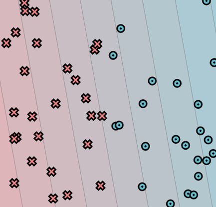
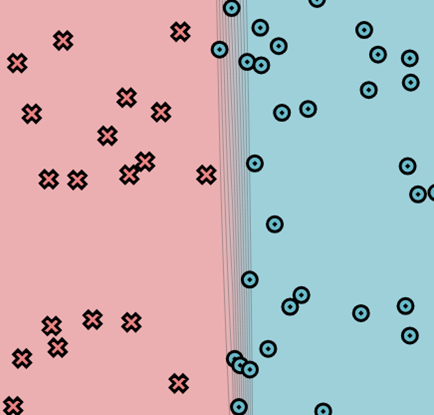
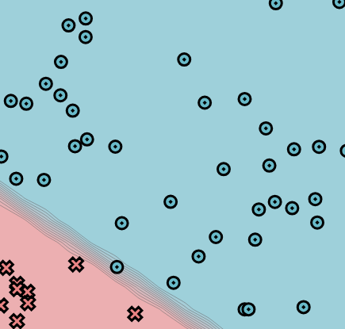
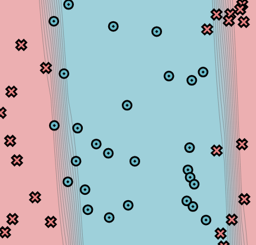
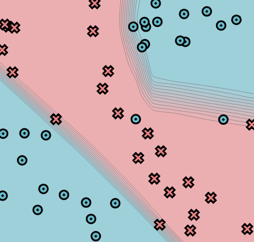
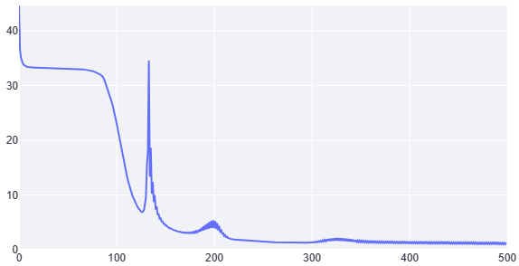
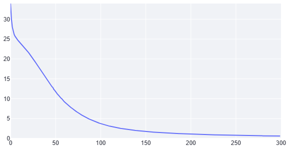
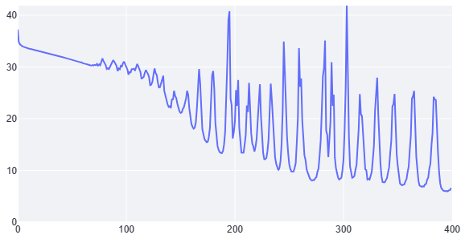
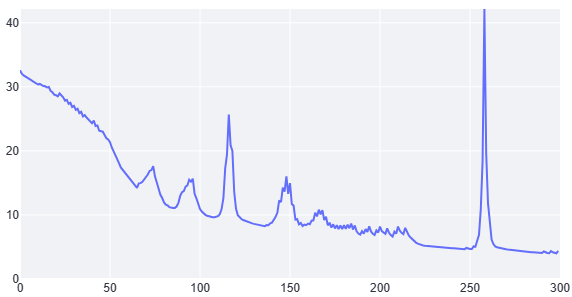

# minitorch
The full minitorch student suite. 

To access the autograder: 

* Module 0: https://classroom.github.com/a/qDYKZff9
* Module 1: https://classroom.github.com/a/6TiImUiy
* Module 2: https://classroom.github.com/a/0ZHJeTA0
* Module 3: https://classroom.github.com/a/U5CMJec1
* Module 4: https://classroom.github.com/a/04QA6HZK
* Quizzes: https://classroom.github.com/a/bGcGc12k

## Results
### Module 0 - Simple Classifier

With parameters:
- linear.weight_0_0 = -1.51
- linear.weight_1_0 = -0.26
- linear.bias_0 = 0.77

### Module 1 - Scalar

| Parameter         | Simple      | Diag         | Split       | XOR         |
| ----------------- | ----------- | ------------ | ----------- | ----------- |
| **Hidden Layers** | 4           | 3            | 5           | 5           |
| **Learning Rate** | 0.5         | 0.5          | 0.5         | 0.5         |
| **Epochs**        | 500         | 300          | 400         | 300         |
| **Final Loss**    | 1.2574      | 0.6139       | 6.5993      | 4.3938      |
| **Accuracy**      | 98% (49/50) | 100% (50/50) | 96% (48/50) | 96% (48/50) |

### Visual Results Table for Module 1

| Dataset  | Simple                                         | Diag                                       | Split                                        | XOR                                      |
| -------- | ---------------------------------------------- | ------------------------------------------ | -------------------------------------------- | ---------------------------------------- |
| **Data** |      |      |      |      |
| **Loss** |  |  |  |  |